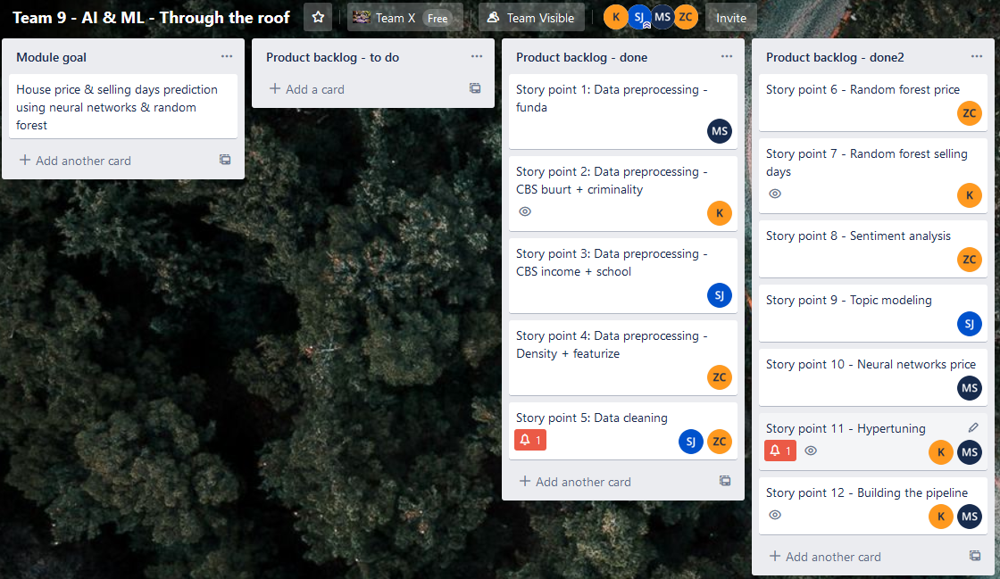
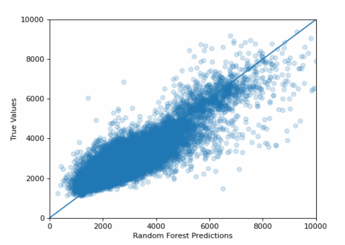
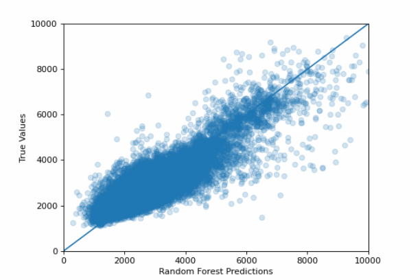

Team 9 decided to take it a one step further and perform sentiment analysis & topic modelling (using LDA) for the full house description.
Sentence tokenizer was applied to detect the language of every sentence and eventually drop English sentences to be able to use Dutch dictionary.
Due to the time limitation, it was not feasible to run those analyses on the whole dataset and then apply it to our predictive models.
It has however fulfilled its purpose and the learning outcomes were increased.
To provide a proof of working, team 9 attached a Jupyter notebook with sentiment and topic modelling located in notebooks/sentiment and topic modelling.

Please download the raw files from the following link (available until 25-01-2020):
https://we.tl/t-KHGYxaqpIH

Trello Board

Plot Random Forest price per square meter

plot XGBooster price per square meter

